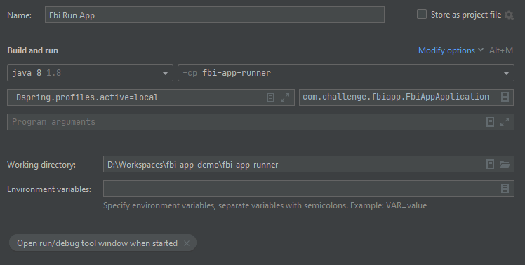

# FBI Application
The FBI application is a **SpringBoot** application that uses **MongoDB** to store the records gathered by the 
FBI Agents in wich, you will be able to query for mobsters, for mobsters that are bosses and imprison or 
relasing them.

The aplication exposes a **REST API** which can be accessed via http request

This project has been planned and split into task in this **[Trello board](https://trello.com/b/gYMO0wZQ/stratio-mafia-challenge)**

#### Api Reference Swagger
You can access the API specification in his swagger file [HERE](doc/fbi-app-swagger.yaml)

#### Project Structure

# How to run this application in local

## 1 MongoDB

In this project you can find the mandatory commands you need to run in order to have a proper running 
MongoDB with data to toy with.

For that you need a **Docker service** running on your machine. Once you have a running installation of Docker in your machine
please, follow this instructions:

* **Navigate with your command client to the `/docker` folder**
* **Run and prepare the Docker Container**
    * _Download and run a mongoDB container_
        * `docker run -d -p 27017-27019:27017-27019 --name mongo-fbi mongo`
    * _Once you have the container mongo-fbi running, copy into it the file `fbi_records.json`_
        * `docker cp fbi_records.json mongo-fbi:/fbi_records.json` 
    * _Access to the container to interact with the database_
        * `docker exec -it mongo-fbi bash`
* **Inside the container, feed the database with the content of `fbi_records.json`**
    * `mongoimport --db mobstersdb --collection mobsters --drop --file /fbi_records.json`
        * _You will see an output like this: `72 document(s) imported successfully. 0 document(s) failed to import.`_
* **Now is time to check if you have stored the data correctly**
    * _Execute the MongoDB client_
         * `mongo`
    * _Use the database in where you stored the data_
         * `use mobstersdb`
    * _Execute a query to check if everything's seems fine_
         * `db.mobsters.find({nickname: "Fat"})`
            * _You will see an output like this: `{ "_id" : ObjectId("601001b710cc1fa134b2a26d"), "name" : "Tony", "surName" : "Soprano", "nickname" : "Fat", "since" : "2021-01-15", "inPrison" : false }
`_

## 2 Run Application
Before running the application via IntelliJ IDEA, you must execute a `mvn clean install` in order to compile the code and generate the file `git.properties` for the GitInformation Endpoint 

To run this project from the IntelliJ IDEA please apply the following configuration

After that, you will have a log stack similar to this:

## Have fun
To query for the services deployed by the application, you can find a API Suite Repository for **Talend API Tester** _(a.k.a Restlet)_ wich 
you have pre-made request aiming your localhost.

